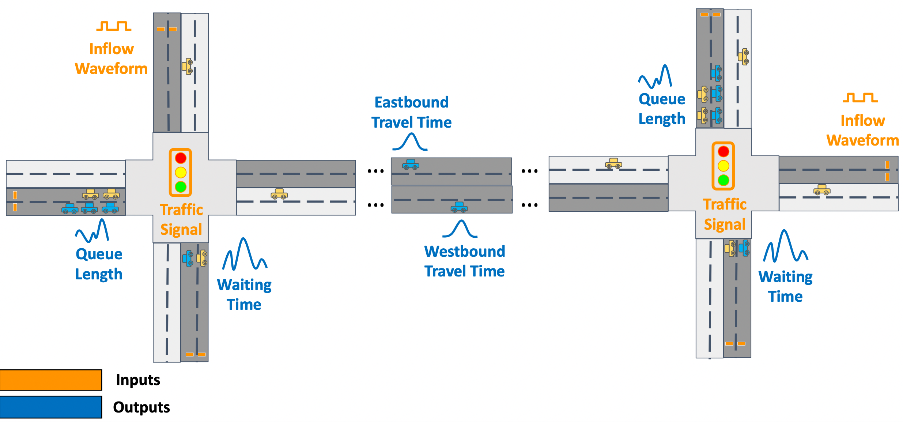
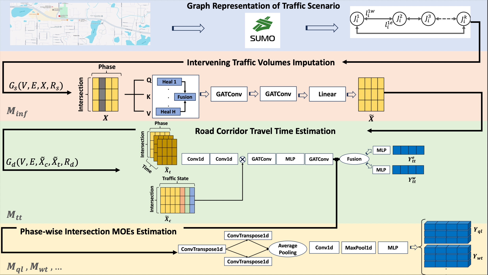
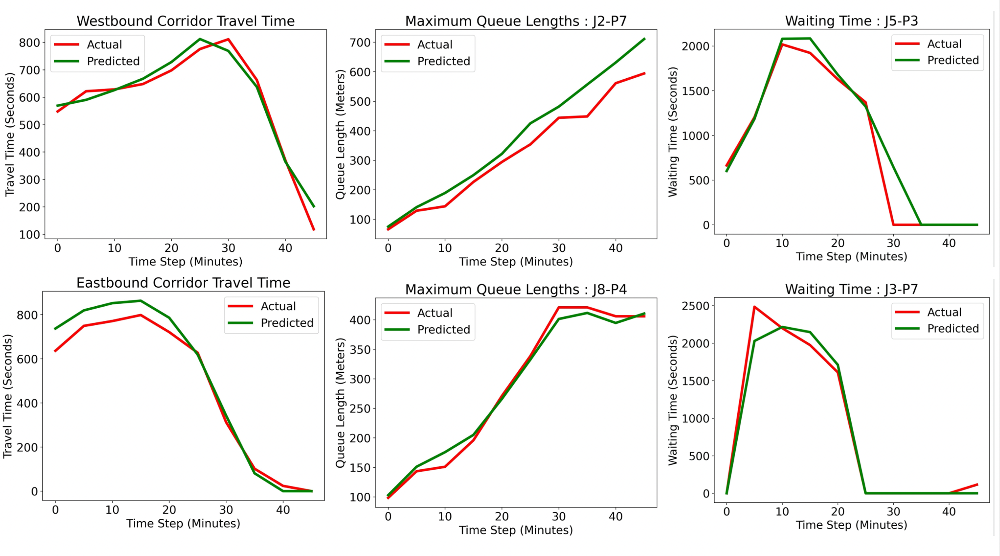

# Temporal Graph-based Digital Twin (TGDT)

A repository for implementation of *TDGT: A Temporal Graph-based Digital Twin for Traffic Urban Corridors* paper.

In this work, we introduce a digital twin to urban traffic corridors for modeling traffic volumes and Measures of Effectiveness (MoEs) at the intersection level and corridor level altogether simultaneously based on Temporal and dynamic graph neural networks (TGNNs). These models are able to provide a fast but optimized and accurate alternative to existing microscopic simulators with many additional advantages. The model is flexible and can be trained on urban corridors with any number and topology of intersections. The model can compute MoEs for each phase of movement and each direction of arterial movement simultaneously. Graph features include basic traffic variables as input parameters including *signal timing plan parameters*, *driver behaviors* and *turning movement count*, *pair-wise distance between intersections*, and *ingress traffic volumes to corridor*.


## The inputs and outputs of TGDT framework
-----


## Architectural overview


## Experiments
-----
you can run the code to train and reproduce the result with default settings using
``python run.py`` 

Model's state dictionary and loss values will be saved in ``models`` directory. The results of the training including plots, error values  will be saved in ``results`` directory.




## Dataset
-----
Total number of 200 graph data samples are provided in ``data`` directory.


## Requirements
-----
* matplotlib==3.8.0
* numpy==1.24.1
* pandas==2.1.1
* scikit-learn==1.3.0
* scipy==1.11.3
* torch-geometric==2.3.1
* torch==2.0.1
* torchvision==0.15.2


## Citations
-----
If you find our work useful in your research, please cite the following paper:
```
@article{
}
```
